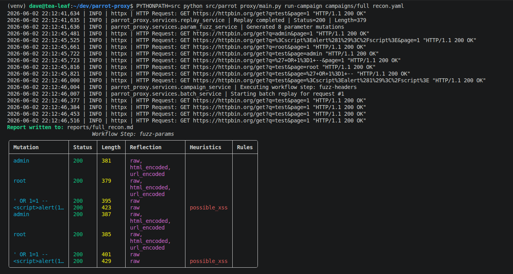
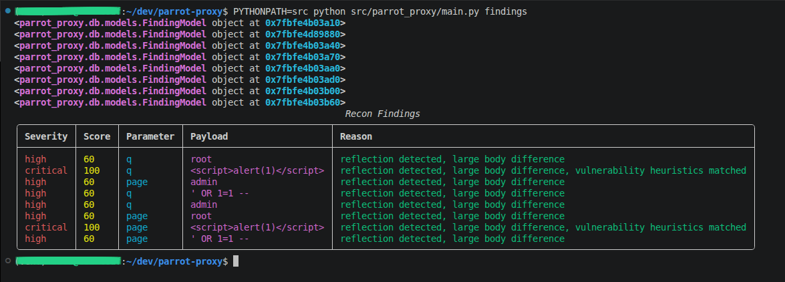
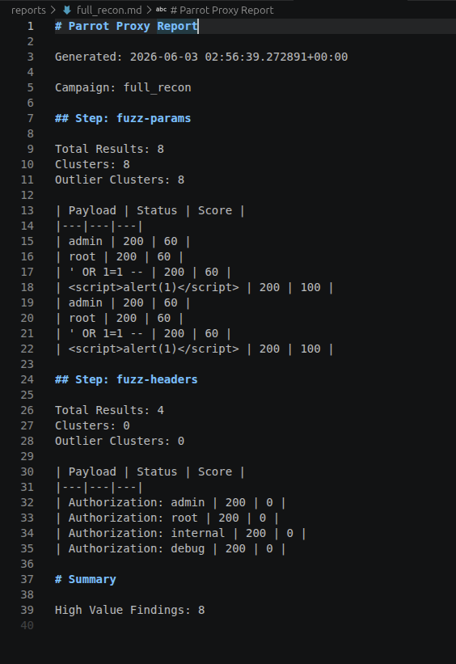
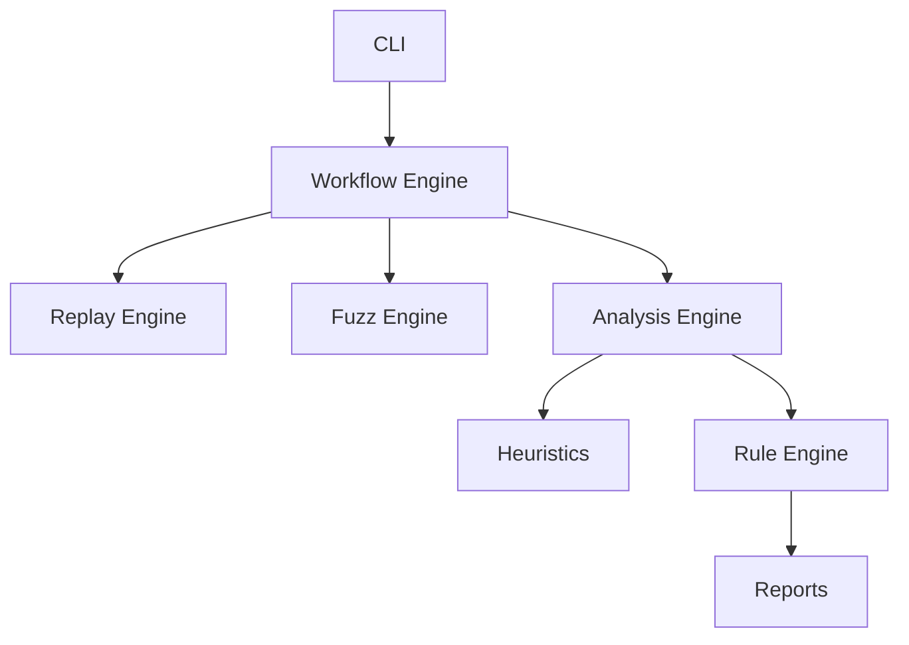

# Parrot-proxy
HTTP Request Analyzer &amp; Replay Tool
A modular HTTP replay, fuzzing and reconnaissance automation framework written in Python.

Captures HTTP requests, stores them locally, replays them with mutations, analyzes responses for anomalies, and generates findings and reports. The project was build to automate common bug bounty and web app reconnaissance workflows.

## Features
### Request Capture

    - Import raw HTTP requests
    - Store requests in a local database
    - Retrieve and replay captured traffic

### Replay Engine

    - Replay saved requests
    - Modify parameters, headers, and request bodies
    - Async replay support
    - Concurrent execution

### Fuzzing

    - Query parameter fuzzing
    - Header fuzzing
    - JSON body fuzzing
    - Payload mutation workflows

### Analysis

    - Response comparison
    - Reflection detection
    - Context-aware reflection analysis
    - Response clustering
    - Anomaly detection
    - Vulnerability heuristics

### Detection Engine

    - SQL error detection
    - XSS reflection detection
    - Path traversal indicators
    - SSTI indicators
    - Custom YAML-based signatures

### Reporing

    - Markdown report generation
    - Campaign summaries
    - Finding exports

### Workflow Automation

    - YAML campaign definitions
    - Multi-stage recon workflows
    - Automated replay pipelines

---

## Screenshots
### Campaign Execution

### Findings

### Generated Report

---

## Architecture

---

## Tech Stack

    - Python 3.12+
    - Typer
    - Rich
    - SQLAlchemy
    - HTTPX
    - SQLite
    - AsyncIO
    - PyYAML

---

## Installation

Clone the repository:

`git clone https://github.com/<your-username>/parrot-proxy.git`

`cd parrot-proxy`

Create a virtual environment:

`python -m venv .venv`

`source .venv/bin/activate`

Install dependencies:

`pip install -r requirements.txt`

Initialize the database:

`PYTHONPATH=src python src/parrot_proxy/main.py init-db`

---

## Quick Start
Capture a request:

`PYTHONPATH=src python src/parrot_proxy/main.py capture request.txt`

Replay a request:

`PYTHONPATH=src python src/parrot_proxy/main.py replay 1`

Run a fuzzing workflow:

`PYTHONPATH=src python src/parrot_proxy/main.py run-campaign campaigns/full_recon.yaml`

Generate findings:

`PYTHONPATH=src python src/parrot_proxy/main.py findings`

---

## Example Campaign
Steps:
    - type: fuzz-params
      payloads:
        - admin
        - root

    - type: fuzz-json
      payloads;
        - "{{7*7}}"
        - ""

---

## Example Report

Reports are automatically generated after campaign execution.

\# Parrot Proxy Report

Campaign: full_recon

High Value Findings: 5

Clusters: 4
Outlier Clusters: 1

---

## Roadmap

### Completed
    - Request capture
    - Replay engine
    - Async execution
    - Parameter fuzzing
    - Header fuzzing
    - JSON body fuzzing
    - Reflection analysis
    - Reporting
    - Vulnerability heuristics
    - Rule engine

### Planned
    - Workflow schema standarization
    - Payload profiles
    - Session management
    - Advanced reporting
    - Plugin Architecture